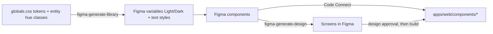

# Figma is Basin's design tool of record; its library is generated from the code's tokens

**Date:** 2026-09-10 · **Status:** Accepted (decided by Kevin 2026-09-06; recorded at library kickoff) · **Scope:** design tooling and the design-to-code loop, site-wide · **Brief:** docs/figma/HANDOFF.md (the session plan this record governs)

Basin's designs that are meant to persist — the design system, screen designs, and new-feature design work — live in one Figma file (`o4uvAOk20uMQ4u1u97JNNW`). The direction of truth does not change: `apps/web/app/globals.css` remains the source of truth for tokens and entity hues, and the Figma library is a **generated mirror** of it. Feature design happens in Figma before build agents run; Code Connect maps library components to `apps/web/components/*` so design reads return Basin's component names. Throwaway HTML mockup artifacts remain available as the cheap first rung.

## 1. Use cases and problems

- Use case: Kevin reviews and *edits* a proposed screen visually before any code is written, instead of reacting to a shipped PR's preview.
- Use case: a new feature's brief links a Figma frame; the PR references the same frame; deviations are visible by comparison.
- Use case: Kevin is deliberately learning Figma (standing rule: learning goals shape stack choices); Basin — with the cleanest token layer of his projects — is the anchor project.
- Problem: design review today happens at the most expensive moment (a built PR). HTML mockups helped but are throwaway — nothing accumulates.
- Problem: DESIGN_PRINCIPLES §13–§15 (fixed entity hues, one visual grammar, both themes designed) are enforced by discipline alone; a component library makes them enforceable by construction.

## 2. Why

The mission commits Basin to being auditable and visually coherent ("trust is the product"); §13–§15 formalized the visual grammar, and a design system is the mechanism that keeps a grammar from drifting (DESIGN_FOUNDATIONS §12: systematize, then subtract). Doing nothing keeps design review at the PR stage and keeps the visual grammar enforced by review vigilance rather than by components. The moment is now because the capture work is done (three reference frames in the file) and the token layer is small and clean — the cost of generating the library will never be lower.

## 3. Proposed solution

Figma becomes the persistent design surface; the repo stays the source of truth for every value in it.

**High-level design.**

- One file, three pages: `00 Captures (reference)` (deleted once screens are approved), `01 Tokens & Components`, `02 Screens`.
- The `Color` collection carries Light and Dark as two modes of one collection — both themes designed, never inverted (§15).
- Entity hues (`cl-*`, `sr-*`, `sp-*`, `sf-*` and the map classes) become one variable each, sourced from where they live in CSS; consolidating them into a single registry in code is a planned repo PR (HANDOFF §6.3) that this record endorses but does not implement.
- Regeneration is the sync mechanism: when tokens or hues change in code, the library is re-run against them. Divergence between a Figma variable and its CSS value is a bug, on the Figma side by definition.

**Out of scope.** The library's exact component inventory (implementation, validated per component); Ledger's and Penny's Figma work; any change to the site's CSS pipeline; the capture-mode repo PR (its own brief).

## 4. Options considered

| Option | Description | Pros | Cons |
|---|---|---|---|
| **A. Figma as design surface, code as token truth** (chosen) | Library generated from `globals.css`; design-before-build in Figma; Code Connect bridges | Design review moves before build; §13–§15 enforceable by components; Kevin's learning goal served; no change to the site's pipeline; reversible (the file is a mirror) | Two surfaces to keep in sync; read rate limits; `use_figma` is beta |
| B. HTML mockups only (status quo) | Claude-built throwaway artifacts per feature | Zero new tooling; fastest single iteration | Nothing accumulates; no visual editing by Kevin; grammar enforced only by review |
| C. Figma as token source of truth | Tokens authored in Figma, exported to CSS (Tokens Studio pattern) | Designer-canonical workflow | Inverts authority over a token layer that is already clean in code; adds an export pipeline; contradicts "the registry/code is the single source" instincts of this repo |
| D. Do nothing | Ad-hoc screenshots and PR previews | No cost | Both problems in §1 persist |

A wins because it adds the missing design surface without moving any source of truth. C would only win if a dedicated designer who lives in Figma joined the project.

## 5. Design principles

- **Code is upstream of the library, always.** A Figma variable's value is correct iff it equals the CSS value it mirrors.
- **Every color in a component is bound to a variable** — no raw hex in components (mirrors "no magic constants in components").
- **Both modes ship together** in one collection; a token without a dark value is incomplete (§15).
- **Captures are scaffolding, not artifacts** — deleted once the rebuilt screens are approved.
- **Design approval happens in Figma before build time** for feature work that changes what a reader sees; the brief links the frame.

## 6. Risks

| Risk | Likelihood / impact | Mitigation | Early signal |
|---|---|---|---|
| Library drifts from CSS as the site evolves | med / med | Regenerate on token change; the planned hue-registry PR makes the source greppable in one place | A shipped chart hue with no matching Figma variable |
| `use_figma` (beta) changes or becomes paid | med / low | The library is regenerable from code at any time; nothing irreplaceable lives only in Figma | Figma changelog / write-call failures |
| Seat/account dependency (the connected account is the household's Professional seat, not Kevin's own) | low / med | Code remains truth; the file can be duplicated or re-created under another plan from the same generators | Seat downgrade or file access errors |
| Read rate limits stall design sessions (~200/day) | med / low | Batch reads; screenshots over repeated context pulls; writes are exempt | 429s in a working session |
| Design-in-Figma adds ceremony to small changes | med / med | The floor stays proportionate: mechanical/small changes keep the brief-in-PR path; Figma gates only reader-visible feature design | Feature PRs stalling on design steps that added nothing |

## 7. Consequences and revisit triggers

Easier: visual design review before build; consistent components; a place for Kevin to work designs by hand; design reads that name real code components. Harder: two surfaces to keep honest; a sync habit that must actually be kept.

Revisit if: the sync habit fails twice (library found stale at review time), `use_figma` pricing makes writes impractical, the seat situation changes, or a dedicated design collaborator joins (which reopens option C).

---

*Rules of use: one file per decision at `docs/decisions/YYYY-MM-DD-<slug>.md`, listed in `docs/decisions/README.md`. Written before the build and read by Kevin first. Append-only: to change a decision, add a new record that supersedes this one and set this one's status to Superseded. The PR that implements the decision links this file.*
